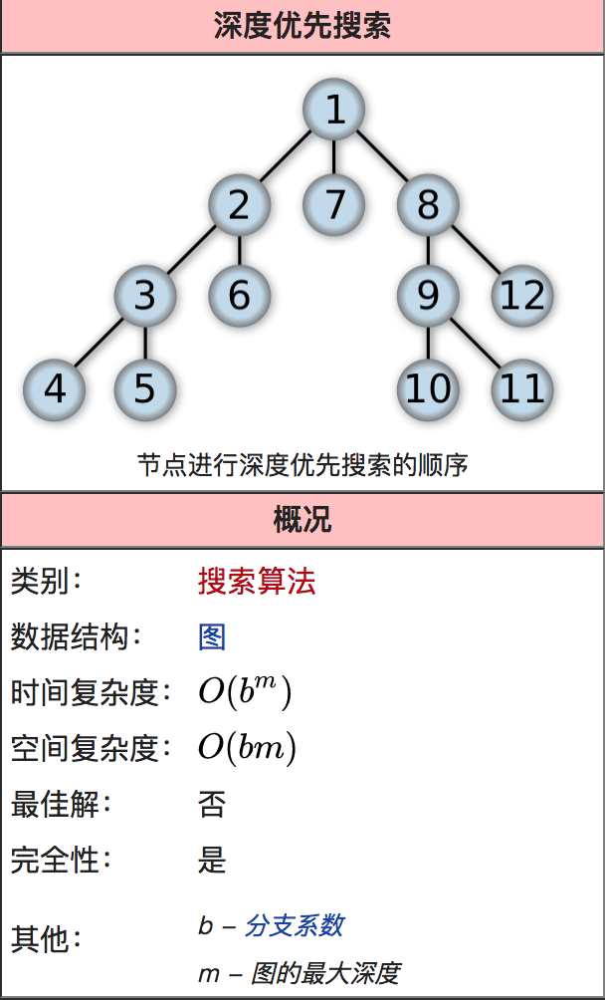

# 搜索算法

```js
var tree = {
    name: "中国",
    children: [
        {
            name: "北京",
            children: [
                {
                    name: "朝阳群众"
                },
                {
                    name: "海淀区"
                },
                {
                    name: "昌平区"
                }
            ]
        },
        {
            name: "浙江省",
            children: [
                {
                    name: "杭州市",
                    code: 0571
                },
                {
                    name: "嘉兴市"
                },
                {
                    name: "绍兴市"
                },
                {
                    name: "宁波市"
                }
            ]
        }
    ]
};
```

## 广度优先搜索（BFS）

bfs ＝队列，入队列，出队列

利用队列。

```js
// 算法实现
function bfs(tree, name) {
    var queue = [];
    queue.push(tree);
    while (queue.length !== 0) {
        var current = queue[0];
        queue.shift();
        if (current.name === name) {
            return current;
        } else {
            current.children &&
                current.children.forEach((node, index) => {
                    queue.push(node);
                });
        }
    }

    return null;
}
```

## 深度优先搜索（DFS）

深度优先搜索算法（英语：Depth-First-Search，简称 DFS）是一种用于遍历或搜索树或图的算法。沿着树的深度遍历树的节点，尽可能深的搜索树的分支。当节点 v 的所在边都己被探寻过，搜索将回溯到发现节点 v 的那条边的起始节点。这一过程一直进行到已发现从源节点可达的所有节点为止。如果还存在未被发现的节点，则选择其中一个作为源节点并重复以上过程，整个进程反复进行直到所有节点都被访问为止。属于盲目搜索。



> 主要思想：不撞南墙不回头。

实现步骤：

1. 首先将根节点放入队列中。

2. 从队列中取出第一个节点，并检验它是否为目标。

    如果找到目标，则结束搜寻并回传结果。

    否则将它某一个尚未检验过的直接子节点加入队列中。

3. 重复步骤 2。

4. 如果不存在未检测过的直接子节点。

    将上一级节点加入队列中。

    重复步骤 2。

5. 重复步骤 4。

6. 若队列为空，表示整张图都检查过了——亦即图中没有欲搜寻的目标。结束搜寻并回传“找不到目标”。

利用栈。dfs=栈，压栈，出栈。

```js
// 算法实现
function dfs(tree, name) {
    var stack = [];
    stack.push(tree);
    while (stack.length !== 0) {
        var current = stack[stack.length - 1];
        stack.pop();
        if (current.name === name) {
            return current;
        } else {
            current.children &&
                current.children.forEach((node, index) => {
                    stack.push(node);
                });
        }
    }

    return null;
}
```
